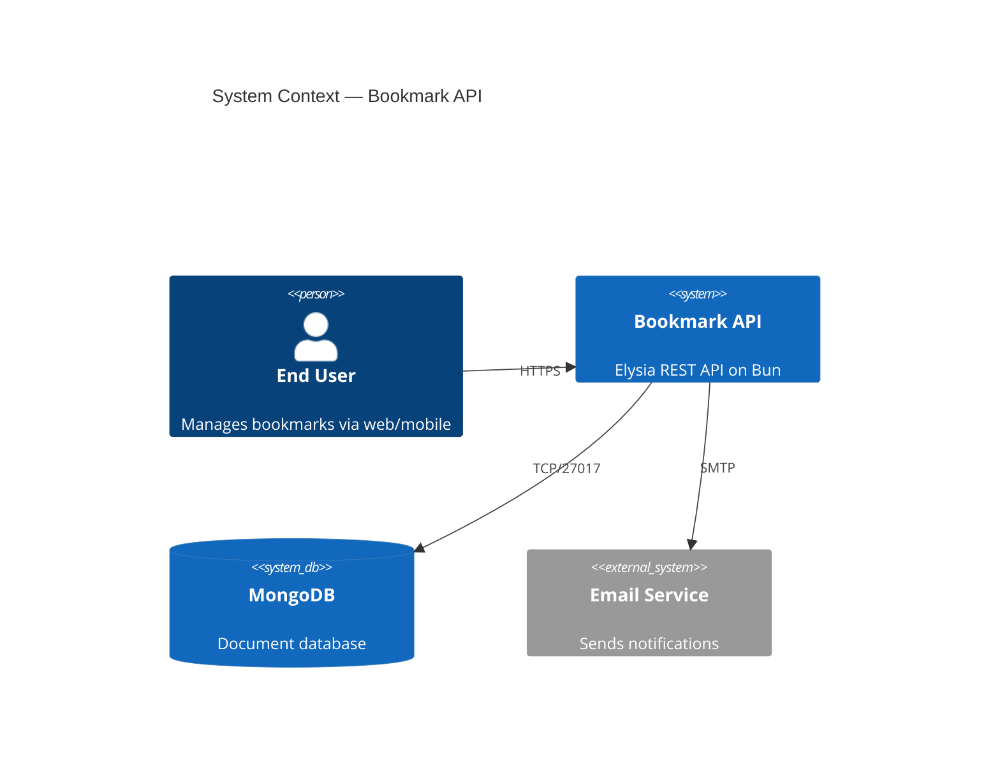
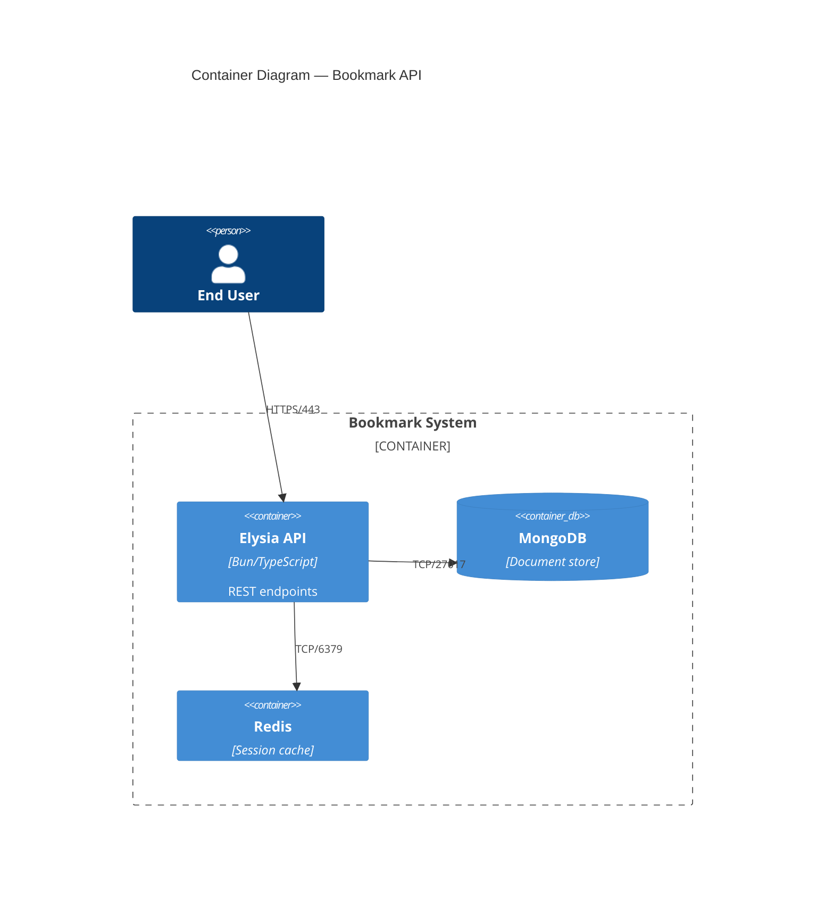
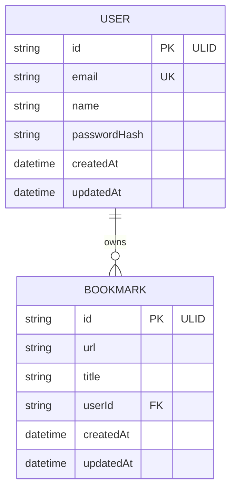
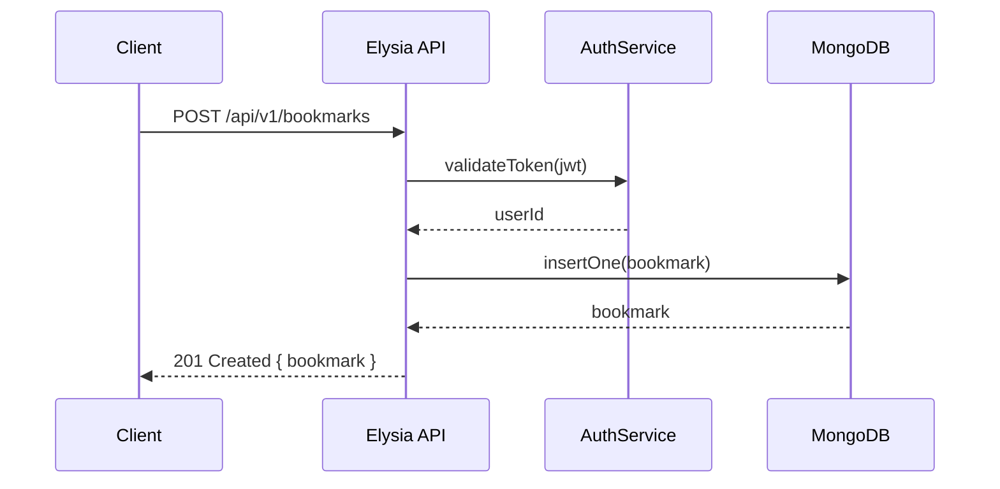

# diagram-generator-agent

A multi-agent pipeline that generates architecture diagrams from Product Requirements Documents (PRDs). Built with Bun, LangChain, and TypeScript.

Given a PRD used to generate an API (via [api-generator-agent](https://github.com/DavisSylvester/api-generator-agent)), this tool automatically produces a full set of architecture diagrams — system context, container, component, sequence, ER, class, flow, and deployment diagrams — in Mermaid, PlantUML, or D2 format.

---

## Table of Contents

- [Features](#features)
- [Quick Start](#quick-start)
- [Installation](#installation)
- [Usage](#usage)
  - [Basic Usage](#basic-usage)
  - [CLI Options](#cli-options)
  - [Output Formats](#output-formats)
  - [Resume a Run](#resume-a-run)
  - [Run Management](#run-management)
- [Architecture](#architecture)
  - [Pipeline Phases](#pipeline-phases)
  - [Agent Architecture](#agent-architecture)
  - [Directory Structure](#directory-structure)
- [Configuration](#configuration)
  - [Environment Variables](#environment-variables)
  - [LLM Providers](#llm-providers)
- [Examples](#examples)
  - [Example PRD Input](#example-prd-input)
  - [Example Mermaid Output](#example-mermaid-output)
  - [Example PlantUML Output](#example-plantuml-output)
  - [Workspace Output Structure](#workspace-output-structure)
- [Code Patterns](#code-patterns)
  - [Result Type](#result-type)
  - [Dependency Injection](#dependency-injection)
  - [Agent Base Class](#agent-base-class)
  - [Cost Tracking](#cost-tracking)
- [Development](#development)
- [Security](#security)
- [Contributing](#contributing)
- [License](#license)

---

## Features

- **Multi-agent pipeline** — Planning, diagram generation, and validation agents work in concert
- **DAG-based parallel execution** — Independent diagrams generate concurrently with dependency ordering
- **Multiple output formats** — Mermaid, PlantUML, and D2 diagram syntax
- **8 diagram types** — System context, container, component, sequence, ER, class, flow, deployment
- **Fix loop with validation** — Diagrams are validated against the PRD and re-generated if issues are found
- **Circuit breaker** — Stops retrying after 5 consecutive iterations with no improvement
- **Plan caching** — Plans cached by PRD hash (SHA-256) to skip re-planning on re-runs
- **Resume support** — Resume interrupted runs from the last completed task
- **Cost tracking** — Per-task and total cost tracking with configurable limits
- **Multi-provider LLM support** — Ollama (local), OpenAI, and Anthropic
- **Model chain fallback** — Automatically falls back to the next model if one fails
- **Telegram notifications** — Optional real-time progress updates
- **Secret redaction** — API keys are never logged or written to output

---

## Quick Start

```bash
# Clone
git clone https://github.com/DavisSylvester/diagram-generator-agent.git
cd diagram-generator-agent

# Install
bun install

# Configure
cp .env.example .env
# Edit .env with your LLM provider settings

# Run
bun run src/index.mts --prd examples/sample-api-prd.md
```

---

## Installation

### Prerequisites

- [Bun](https://bun.sh) v1.1+
- An LLM provider:
  - **Ollama** (free, local) — [Install Ollama](https://ollama.ai)
  - **OpenAI** — API key from [platform.openai.com](https://platform.openai.com)
  - **Anthropic** — API key from [console.anthropic.com](https://console.anthropic.com)

### Install

```bash
git clone https://github.com/DavisSylvester/diagram-generator-agent.git
cd diagram-generator-agent
bun install
cp .env.example .env
```

### Configure your provider

```bash
# For Ollama (default — free, runs locally)
# Just make sure Ollama is running: ollama serve
# Pull a model: ollama pull qwen3.5:27b

# For OpenAI
echo 'LLM_PROVIDER=openai' >> .env
echo 'OPENAI_API_KEY=sk-your-key-here' >> .env

# For Anthropic
echo 'LLM_PROVIDER=anthropic' >> .env
echo 'ANTHROPIC_API_KEY=sk-ant-your-key-here' >> .env
```

---

## Usage

### Basic Usage

```bash
# Generate diagrams from a PRD (default: Mermaid format)
bun run src/index.mts --prd path/to/your-api-prd.md

# Or use the launcher script
./run.sh --prd path/to/your-api-prd.md
```

### CLI Options

```
USAGE
  bun run src/index.mts --prd <file>              Start new diagram generation
  bun run src/index.mts --resume <run-id>          Resume an interrupted run
  bun run src/index.mts --list-runs                List all previous runs
  bun run src/index.mts --status <run-id>          Show task status for a run

OPTIONS
  --prd <file>          Path to the PRD markdown file
  --resume <run-id>     Resume a previous run by ID
  --list-runs           List all previous runs and their status
  --status <run-id>     Show detailed task status for a run
  --iterations <n>      Max fix iterations per diagram (default: 5 or env)
  --max-tasks <n>       Limit to first N diagram tasks
  --concurrency <n>     Parallel task limit (default: 4 or env)
  --format <fmt>        Output format: mermaid, plantuml, d2 (default: mermaid)
  --no-docs             Skip documentation generation
  --no-validate         Skip diagram validation
  --help                Show help message
```

### Output Formats

```bash
# Mermaid (default)
bun run src/index.mts --prd prd.md --format mermaid

# PlantUML
bun run src/index.mts --prd prd.md --format plantuml

# D2
bun run src/index.mts --prd prd.md --format d2
```

### Resume a Run

```bash
# If a run is interrupted, find the run ID:
bun run src/index.mts --list-runs

# Resume it:
bun run src/index.mts --resume 01JARX9KP3M2VBCDE4567FG8H
```

### Run Management

```bash
# List all runs
bun run src/index.mts --list-runs

# Check status of a specific run
bun run src/index.mts --status 01JARX9KP3M2VBCDE4567FG8H
```

### Background Execution

```bash
# Linux/macOS
./run-bg.sh --prd prd.md --format mermaid
tail -f .workspace/bg.log

# Windows
run-bg.cmd --prd prd.md --format mermaid
```

---

## Architecture

### Pipeline Phases

```
Phase 0: Workspace Setup
  └── Create .workspace/<runId>/ directory structure
  └── Load completed tasks if resuming

Phase 1: Planning
  └── Send PRD to PlanningAgent
  └── Receive task graph (DAG of diagram tasks)
  └── Cache plan by PRD SHA-256 hash

Phase 2: Diagram Generation
  └── Execute task graph via ParallelExecutor
  └── Each task runs through fix loop:
      ├── Step 1: DiagramAgent generates/fixes diagram
      ├── Step 2: ValidationAgent checks against PRD
      └── Loop until valid or max iterations

Phase 3: Summary
  └── Log cost summary
  └── Save execution summary & token usage
  └── Send completion notification
```

### Agent Architecture

All agents extend `BaseAgent<TIn, TOut>` which provides:
- Model chain fallback (try primary, then secondary, etc.)
- Timeout handling
- Token usage tracking
- Result<T, E> return types

```
BaseAgent<TIn, TOut>
  ├── PlanningAgent      — PRD → TaskGraph
  ├── DiagramAgent       — Task + PRD → DiagramFile[]
  └── ValidationAgent    — DiagramFile + PRD → ValidationResult
```

### Directory Structure

```
diagram-generator-agent/
├── .github/
│   └── workflows/
│       ├── ci.yml                 # Type check + lint + test
│       └── codeql.yml             # Security scanning
├── src/
│   ├── index.mts                  # CLI entry point
│   ├── cli/
│   │   └── parse-args.mts         # Argument parsing
│   ├── config/
│   │   ├── env.mts                # Zod env validation
│   │   └── models.mts             # LLM model configuration
│   ├── container/
│   │   └── di.mts                 # Dependency injection container
│   ├── types/
│   │   ├── result.mts             # Result<T, E> type
│   │   ├── ok.mts / err.mts       # Constructors
│   │   ├── task.mts               # Task & TaskGraph types
│   │   ├── diagram-file.mts       # DiagramFile type
│   │   ├── pipeline-config.mts    # Config type
│   │   ├── agent-output.mts       # AgentOutput type
│   │   └── index.mts              # Barrel exports
│   ├── interfaces/
│   │   ├── i-llm-factory.mts      # LLM factory interface
│   │   └── i-notifier.mts         # Notification interface
│   ├── llm/
│   │   ├── ollama-factory.mts     # Ollama provider
│   │   ├── openai-factory.mts     # OpenAI provider
│   │   ├── anthropic-factory.mts  # Anthropic provider
│   │   └── cost-tracker.mts       # Token cost tracking
│   ├── agents/
│   │   ├── base-agent.mts         # Abstract base with fallback
│   │   ├── planning-agent.mts     # PRD → task decomposition
│   │   ├── diagram-agent.mts      # Task → diagram generation
│   │   └── validation-agent.mts   # Diagram → validation
│   ├── orchestrator/
│   │   ├── pipeline.mts           # Full pipeline phases
│   │   └── fix-loop.mts           # Per-task iteration logic
│   ├── graph/
│   │   └── parallel-executor.mts  # DAG-based parallel execution
│   ├── io/
│   │   └── workspace.mts          # File I/O & workspace management
│   ├── input/
│   │   └── prd-parser.mts         # PRD file parsing
│   ├── prompts/
│   │   ├── planning.mts           # Planning system prompt
│   │   └── diagram.mts            # Diagram generation prompt
│   └── notifications/
│       ├── console-channel.mts    # Console logging
│       ├── telegram-channel.mts   # Telegram bot
│       └── notifier.mts           # Multi-channel dispatcher
├── tests/
│   ├── parse-args.test.mts        # CLI parsing tests
│   └── result.test.mts            # Result type tests
├── examples/
│   └── sample-api-prd.md          # Example PRD input
├── docs/                          # Documentation
├── .gitignore
├── .env.example
├── package.json
├── tsconfig.json
├── eslint.config.mjs
├── SECURITY.md
├── CONTRIBUTING.md
├── run.sh / run.cmd               # Foreground launchers
└── run-bg.sh / run-bg.cmd         # Background launchers
```

---

## Configuration

### Environment Variables

| Variable                  | Required | Default                   | Description                          |
|---------------------------|----------|---------------------------|--------------------------------------|
| `LLM_PROVIDER`            | No       | `ollama`                  | LLM provider: ollama, openai, anthropic |
| `OLLAMA_HOST`              | No       | `http://localhost:11434`  | Ollama server URL                    |
| `OLLAMA_API_KEY`           | No       | —                         | Ollama cloud API key                 |
| `OPENAI_API_KEY`           | If openai| —                         | OpenAI API key                       |
| `ANTHROPIC_API_KEY`        | If anthropic | —                     | Anthropic API key                    |
| `MAX_FIX_ITERATIONS`      | No       | `5`                       | Max fix iterations per task (1–20)   |
| `MAX_CONCURRENCY`          | No       | `4`                       | Parallel task limit (1–8)            |
| `LLM_TIMEOUT_MS`          | No       | `1800000`                 | LLM call timeout in ms              |
| `WORKSPACE_DIR`            | No       | `.workspace`              | Output directory                     |
| `TASK_COST_LIMIT`          | No       | `3.00`                    | Max cost per task in USD             |
| `TELEGRAM_BOT_TOKEN`      | No       | —                         | Telegram bot token                   |
| `TELEGRAM_CHAT_ID`        | No       | —                         | Telegram chat ID                     |

### LLM Providers

#### Ollama (Local — Free)

```bash
# Install Ollama
curl -fsSL https://ollama.ai/install.sh | sh

# Pull models
ollama pull qwen3.5:27b
ollama pull qwen3-coder-next

# .env
LLM_PROVIDER=ollama
OLLAMA_HOST=http://localhost:11434
```

#### OpenAI

```bash
# .env
LLM_PROVIDER=openai
OPENAI_API_KEY=sk-your-key-here
```

#### Anthropic

```bash
# .env
LLM_PROVIDER=anthropic
ANTHROPIC_API_KEY=sk-ant-your-key-here
```

---

## Examples

### Example PRD Input

See [`examples/sample-api-prd.md`](examples/sample-api-prd.md) for a complete example. Here's a minimal PRD:

```markdown
# My API

## Overview
A REST API for managing bookmarks with user authentication.

## Data Model

### User
- id: ULID
- email: string (unique)
- name: string

### Bookmark
- id: ULID
- url: string
- title: string
- userId: ULID (FK -> User)

## Endpoints
- POST /api/v1/auth/login
- GET /api/v1/bookmarks
- POST /api/v1/bookmarks
- DELETE /api/v1/bookmarks/:id
```

### Example Mermaid Output

**System Context Diagram:**



**Container Diagram:**



**ER Diagram:**



**Sequence Diagram:**



### Example PlantUML Output

```plantuml
@startuml
!include https://raw.githubusercontent.com/plantuml-stdlib/C4-PlantUML/master/C4_Context.puml

title System Context — Bookmark API

Person(user, "End User", "Manages bookmarks")
System(api, "Bookmark API", "Elysia REST API")
SystemDb(db, "MongoDB", "Document store")

Rel(user, api, "HTTPS")
Rel(api, db, "MongoDB Wire Protocol")
@enduml
```

### Workspace Output Structure

After a successful run, the workspace contains:

```
.workspace/01JARX9KP3M2VBCDE4567FG8H/
├── config.json                        # Run configuration
├── plan.json                          # Task graph (diagram tasks)
├── execution-summary.json             # Final results summary
├── token-usage.json                   # Cost & token breakdown
├── logs/
│   └── run.log                        # Structured JSON log
├── output/
│   └── diagrams/
│       ├── system-context.mmd         # Mermaid system context
│       ├── container.mmd              # Mermaid container diagram
│       ├── component.mmd              # Mermaid component diagram
│       ├── sequence.mmd               # Mermaid sequence diagram
│       ├── er-diagram.mmd             # Mermaid ER diagram
│       ├── class-diagram.mmd          # Mermaid class diagram
│       ├── flow.mmd                   # Mermaid flow diagram
│       └── deployment.mmd             # Mermaid deployment diagram
└── tasks/
    ├── task-1/
    │   ├── status.json                # Task completion state
    │   └── iterations/
    │       ├── 0/                     # First attempt
    │       └── 1/                     # Fix attempt (if needed)
    ├── task-2/
    │   └── ...
    └── ...
```

---

## Code Patterns

These patterns match the [api-generator-agent](https://github.com/DavisSylvester/api-generator-agent) architecture.

### Result Type

All async operations return `Result<T, E>` instead of throwing exceptions:

```typescript
// src/types/result.mts
type Result<T, E = Error> = Ok<T> | Err<E>;

// Usage in services
const prdResult = await parsePrd(filePath, logger);

if (!prdResult.ok) {
  logger.error(`Failed: ${prdResult.error.message}`);
  process.exit(1);
}

// Type narrows to Ok<ParsedPrd> here
const prd = prdResult.value;
```

### Dependency Injection

All services, agents, and infrastructure are resolved through the DI container:

```typescript
// src/container/di.mts
export interface Container {
  readonly logger: Logger;
  readonly primaryFactory: ILlmFactory;
  readonly planningAgent: PlanningAgent;
  readonly diagramAgent: DiagramAgent;
  readonly validationAgent: ValidationAgent;
  readonly costTracker: CostTracker;
  readonly workspace: Workspace;
  readonly executor: ParallelExecutor;
  readonly notifier: INotifier;
  readonly pipelineConfig: PipelineConfig;
}

// Bootstrap
const env = loadEnv(bootLogger);
const container = createContainer(env, cliOverrides);

// Use — no `new` outside the container
const result = await container.planningAgent.run(input);
```

### Agent Base Class

All agents extend `BaseAgent<TIn, TOut>` for model chain fallback:

```typescript
// src/agents/base-agent.mts
export abstract class BaseAgent<TIn, TOut> {
  protected abstract execute(input: TIn, model: BaseChatModel): Promise<TOut>;

  async run(input: TIn): Promise<Result<AgentOutput<TOut>, Error>> {
    // Tries each model in the chain until one succeeds
    for (const entry of this.modelChain) {
      try {
        const result = await this.withTimeout(this.execute(input, entry.model));
        return ok({ result, model: entry.name, durationMs, tokenUsage });
      } catch {
        continue; // Try next model
      }
    }
    return err(new Error(`All models exhausted`));
  }
}

// Concrete agent
export class DiagramAgent extends BaseAgent<DiagramInput, DiagramFile[]> {
  protected async execute(input: DiagramInput, model: BaseChatModel): Promise<DiagramFile[]> {
    const messages = [new SystemMessage(DIAGRAM_SYSTEM_PROMPT), new HumanMessage(userPrompt)];
    const response = await model.invoke(messages);
    return this.parseDiagramResponse(response);
  }
}
```

### Cost Tracking

Every LLM call is tracked with per-model pricing:

```typescript
// Record usage after each agent call
costTracker.record(
  result.value.model,         // e.g., "claude-sonnet-4-6"
  result.value.tokenUsage.inputTokens,
  result.value.tokenUsage.outputTokens,
  task.id,
);

// Check limits
const taskCost = costTracker.getTaskCost(task.id);
if (taskCost > config.taskCostLimit) {
  // Abort task — budget exceeded
}

// Final summary
const summary = costTracker.getSummary();
// { totalCost, totalInputTokens, totalOutputTokens, byModel, byTask }
```

### Fix Loop

Each diagram task runs through a generate → validate → fix cycle:

```typescript
for (let iteration = 0; iteration < maxIterations; iteration++) {
  // Step 1: Generate or fix the diagram
  const diagramResult = await diagramAgent.run({
    mode: iteration === 0 ? 'generate' : 'fix',
    errors: lastErrors,
    ...taskInput,
  });

  // Step 2: Validate against PRD
  const validation = await validationAgent.run({
    diagram: diagramResult,
    prdContent,
  });

  if (validation.valid) {
    return { status: 'completed', diagrams };
  }

  // Circuit breaker: stop if no improvement for 5 iterations
  if (consecutiveNoImprovement >= 5) {
    return { status: 'failed', circuitBroken: true };
  }

  lastErrors = validation.errors;
}
```

### Env Validation

All environment variables are validated at startup with Zod:

```typescript
// src/config/env.mts
const envSchema = z.object({
  LLM_PROVIDER: z.enum(['ollama', 'openai', 'anthropic']).default('ollama'),
  MAX_FIX_ITERATIONS: z.coerce.number().int().min(1).max(20).default(5),
  MAX_CONCURRENCY: z.coerce.number().int().min(1).max(8).default(4),
  TASK_COST_LIMIT: z.coerce.number().min(0.01).default(3.00),
  // ...
});

// Exits immediately with descriptive errors if invalid
const config = loadEnv(logger);
```

---

## Development

```bash
# Install dependencies
bun install

# Type check
bunx tsc --noEmit

# Lint
bunx eslint src/

# Run tests
bun test

# Watch mode
bun --watch src/index.mts --prd examples/sample-api-prd.md
```

---

## Security

See [SECURITY.md](SECURITY.md) for the full security policy. Key points:

- API keys loaded from environment variables only — never hardcoded
- Winston log redaction strips `sk-*`, `sk-ant-*`, `key-*` patterns
- No credentials written to workspace output
- `.env` excluded from git via `.gitignore`
- Dependabot monitors for vulnerable dependencies
- CodeQL scanning enabled via GitHub Actions

---

## Contributing

See [CONTRIBUTING.md](CONTRIBUTING.md) for guidelines.

---

## License

MIT
